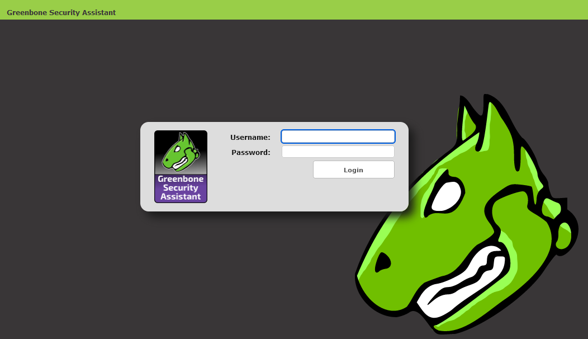
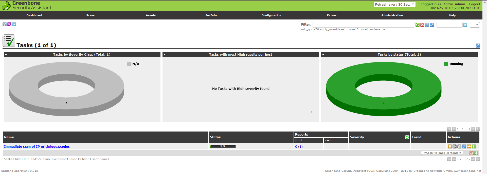

# CS3353 Lab 2 - Eric Iniguez

## Install Docker

1. Download and install Desktop from here:
<https://www.docker.com/products/docker-desktop>
Most operating systems should be able to install Docker Desktop, which provides a graphical user interface
for managing docker containers and images.

2. With Docker Desktop now installed, open a terminal and proceed to the next section.

    * For Windows, you may use Powershell or `cmd.exe`

    * For MacOS, you may use Terminal or iTerm2

    * If using Windows Subsystem for Linux, you can install docker with your package manager
      * `sudo apt install docker`

## Run a docker container using the openvas docker image

For further reference, the `mikesplain/openvas` Github repository contains detailed instructions for using the docker image and can be found here: <https://github.com/mikesplain/openvas-docker>

We are going to run a container using the `mikesplain/openvas` docker image through port 443, so that we can access the container from our web browser.


`docker run -d -p 443:443 --name openvas mikesplain/openvas`

`-d` allows us to run the container in the background, as a daemon

`-p` allows us to expose a port from the container through a port on our computer.
In this case, we are exposing port 443 of the container (left number) to port 443 of
our computer (right number).

`--name` allows us to place a label on the container so that we can easily reference it later

## Open the container in a webpage

In your web browser, navigate to `https://localhost` to access the OpenVAS web console.

On the webpage, you will be asked to login.

Enter `admin` for the username.

Enter `admin` for the password.



## Perform a vulnerability scan

1. Click the submenu: 'Scans' > 'Tasks'

2. Follow the suggestion and click on the purple magic wand button.

3. Select 'Task Wizard'

4. Input the IP address or hostname of the host who you want to scan for vulnerabilities.

5. Wait for the scanner to complete its scan.

6. Congratulations, you've scanned a host with an OpenVAS docker container!



## Docker Compose Code Block

```docker-compose
version: latest
services:
    openvas:
        ports:
            - '443:443'
        container_name: openvas
        image: mikesplain/openvas
```

## Run Container Using Docker Compose

We can run `docker-compose` to compose containers based on the contents of the `docker-compose.yml` file

`docker-compose up -d`

The `-d` option lets us run the container in the background, as a daemon.
