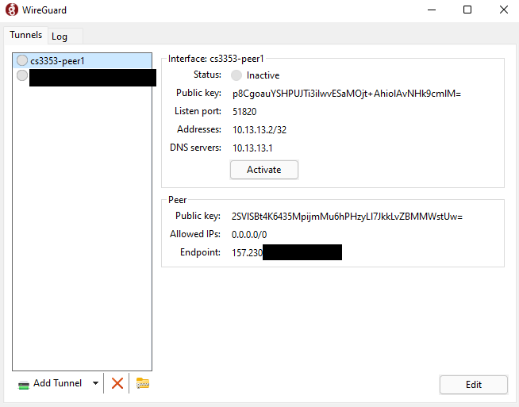
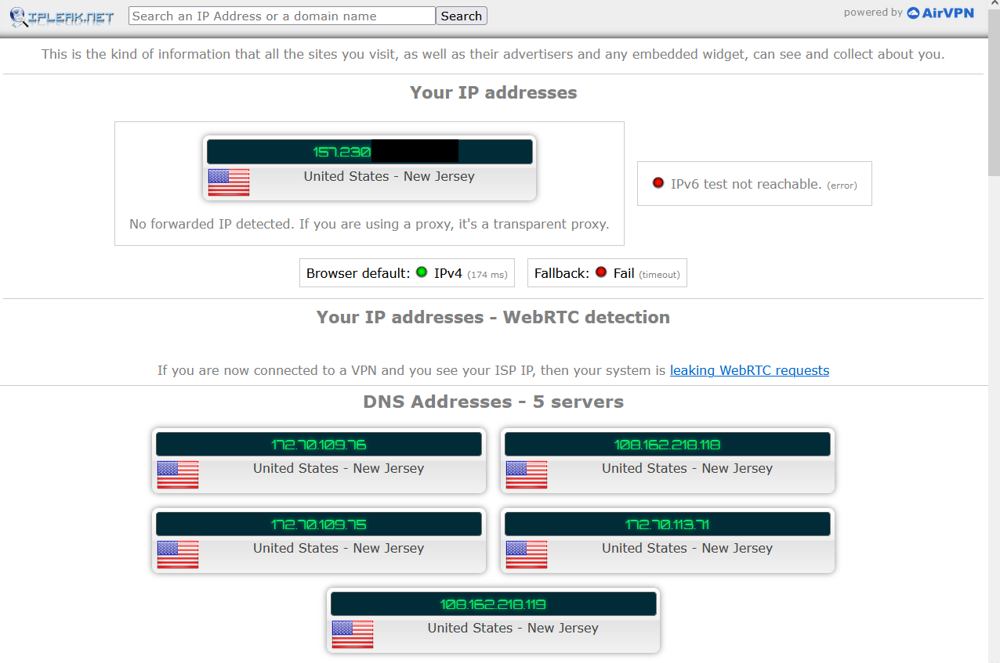
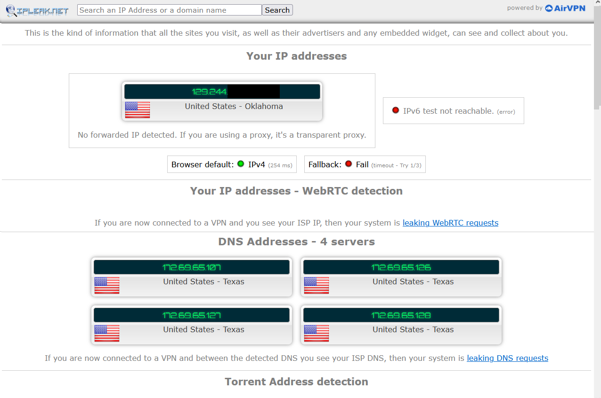
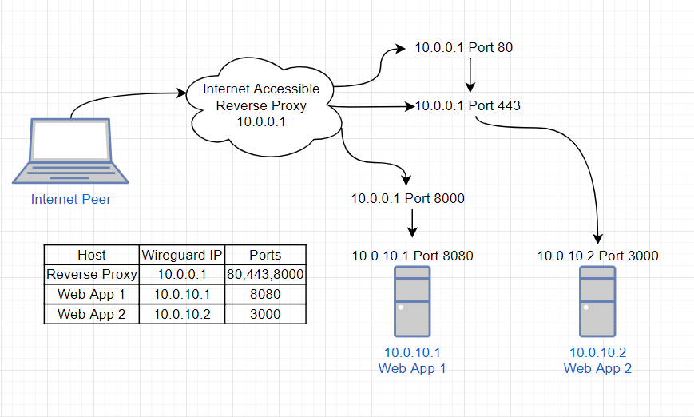

# CS3353 Lab 3 - Eric Iniguez

## Wireguard VPN using Docker

## Step 1 - Create a DigitalOcean Account

DigitalOcean is a cloud infrastructure provider that will allow us to create
a virtual machine hosted in a DigitalOcean data center that we can access
through the internet.

## Step 2 - Create a DigitalOcean Droplet

In your home menu, you should see a "Create" button in the top right corner.

1. Click the "Create" button and then click the "Droplets" item that appears.
2. You should have been taken to a new menu to craft your new Droplet.
3. For Image, choose the latest Ubuntu LTS distribution. At the time of writing, this would be Ubuntu 20.04 LTS x64
4. Choose the Basic plan
5. Choose "Regular Intel with SSD", or the least expensive CPU option.
6. Choose the option with "$5/mo", or the least expensive plan.
7. Select a datacenter region for your Droplet, ideally the datacenter closest to you. I will be choosing San Francisco 3.
8. For Authentication, choose "SSH keys" if you already have SSH keys set up on your personal machine.
   1. Add your SSH Key to the Authentication menu.
   2. If you don't have SSH keys set up already, choose "Password". This will be less secure but will make the process easier.
9. Change the hostname of your Droplet if you'd like.
   * For the scope of our task, the hostname mostly serves to help easily identify the Droplet but should not impact any other part of this task.
10. Click "Create Droplet" to create your new Droplet!
11. You can access your Droplet by selecting it from the droplets list of your DigitalOcean project.
12. In the upper right menu options, click "Console" to open an SSH console in your new Droplet virtual machine!

## Step 3 - Install Docker

First, update your Droplet's package list to make sure you can get the latest version of Docker.

`sudo apt update`

Now, install Docker and docker-compose

`sudo apt install docker docker-compose`

## Step 4 - Install Wireguard using `docker-compose`

The following instructions are based off of the documentation for linuxserver.io's wireguard docker image,
which can be found here: <https://github.com/linuxserver/docker-wireguard>

Using your preferred command line text editor, create a file named `docker-compose.yml`

For this example, we will use the `nano` text editor.

`nano docker-compose.yml`

With the file open in `nano` paste the following in:

```yml
---
version: "2.1"
services:
  wireguard:
    image: lscr.io/linuxserver/wireguard
    container_name: wireguard
    cap_add:
      - NET_ADMIN
      - SYS_MODULE
    environment:
      - PUID=1000
      - PGID=1000
      - TZ=America/Chicago
      - PEERS=1 #optional
      - PEERDNS=auto #optional
      - INTERNAL_SUBNET=10.13.13.0 #optional
      - ALLOWEDIPS=0.0.0.0/0 #optional
    volumes:
      - /path/to/appdata/config:/config
      - /lib/modules:/lib/modules
    ports:
      - 51820:51820/udp
    sysctls:
      - net.ipv4.conf.all.src_valid_mark=1
    restart: unless-stopped
```

You can change the `TZ` field to be your timezone.
In my case, I will use the United States' Chicago timezone by specifying `America/Chicago`

Enter `ctrl+x` to exit the `nano` text editor. Press `y` to say yes to saving the file.

Run your `docker-compose.yml` file with:

`sudo docker-compose up -d`

This composes a docker container as specified in the `docker-compose.yml` file.

`sudo` allows us to run the compose command with super user privileges to be
able to access system resources that may need super user authorization.

The `-d` flag allows us to run the container in the background as a daemon, so that
we can continue to use our Droplet console.

Congrats! You now have a Wireguard VPN server running in your Droplet.
Proceed to the next section to start using your new VPN.

## Step 5 - Test VPN Connection

1. From your Droplet console, open a shell in your wireguard docker container using:

`sudo docker exec -it wireguard bash`

2. Change to the wireguard server's configuration directory:

`cd /config`

3. Read the tunnel configuration file for peer1:

`cat peer1/peer1.conf`

4. Copy the output of the `cat` command we just ran. We will be pasting this into a
tunnel configuration file on our client.

5. Download and install a wireguard client for your computer from <https://download.wireguard.com>

6. In the bottom left corner of your wireguard client window, select the drop-down menu option
"Add empty tunnel..."

7. Select all of the text in the file that appears and paste in the contents of the `peer1.conf` file.

8. Give your tunnel a name and select "Save" to save your new tunnel to your client.

9. Select your new tunnel and click "Activate" to activate the tunnel to your Wireguard VPN server.



10. In a web browser, navigate to <https://ipleak.net> to see information about your IP address.

If your tunnel is activated, you should be seeing the public IPv4 IP address of your DigitalOcean Droplet.
With our tunnel configuration, our computer's internet traffic is routed through our DigitalOcean Droplet,
so our presence online is as though we connect to the internet from our Droplet and not the modem of your
Internet Service Provider (ISP).

Because my Droplet is located in DigitalOcean's NYC-1 region datacenter, my IP location is in New Jersey.



If your tunnel is deactivated, you should be seeing your original public IPv4 IP address as assigned
to you by your modem connected to your Internet Service Provider.

Because I'm currently in Oklahoma, ipleak.net tells me that my original IP address is located in Oklahoma.
Because I personally set my DNS servers to Cloudflare's `1.1.1.1`, ( More info at <https://1.1.1.1> ), ipleak.net
says that my DNS addresses are in Texas at one of Cloudlare's datacenters.



## BONUS - Port Routing Shenanigans ( Reverse Proxy )

Let's say you want to connect to your VPN but your network blocks unusual ports like
Wireguard's 51820. You can change your VPN port to be a more common like the HTTP protocol's port 80.

Without further configuring your docker container, you can use your Droplet to route between its ports.

Using the `nginx` webserver, we can listen on any arbitrary port like port 80 and re-route traffic on port 80 to the Droplet's port 51820.

### Install nginx

Download and install the latest version of nginx to your Droplet

`sudo apt update -y && sudo apt install -y nginx`

Make sure your `nginx` webserver is running by running:

`sudo systemctl start nginx`

### Configure your nginx

Open `/etc/nginx/nginx.conf` with super user privileges in your preferred text editor.

`sudo nano /etc/nginx/nginx.conf`

Right after the line that reads `stream{`, add the following code block:

```text
server {
    listen 80 udp;
    proxy_pass 127.0.0.1:51820;
}
```

Enter `ctrl+x` and `y` to save and quit `nano`

Test your `nginx` config file by running:

`sudo nginx -t`

This should return successful, otherwise, you will need to debug your `/etc/nginx/nginx.conf` file.

Reload your `nginx` web server.

`sudo nginx -s reload`

We just configured the `nginx` to listen for UDP connections on the Droplet's port 80,
then to pass those connection to the Droplet's port 51820.

### Connect to your VPN through Port 80

Edit your computer's tunnel configuration file to use Port 80 by changing the number 51820 to 80
after the colon in the endpoint address field.

Activate your tunnel to connect to your VPN over port 80. 

Congrats! Your network should be seeing that your computer has a connection on port 80, appearing as though you are browsing the internet with the HTTP protocol. In reality, you are connecting to a VPN to encrypt your computer's network traffic.

### Closing Thoughts

We effectively created a Reverse Proxy that proxies connections from one port to another.
This is especially useful if you wish to connect to multiple computers through the multiple ports of a reverse proxy server.

See the following `nginx` configuration code:

```text
server{
    listen 8000;
    proxy_pass 10.0.10.1:8080;
}
server {
    # A more robust implementation would return code 301 instead of passing to port 443,
    # but this rule serves to show that we can route traffic between ports on the same host
    listen 80;
    proxy_pass 127.0.0.1:443;
}
server {
    listen 443 ssl;

    ssl on;
    ssl_certificate /etc/nginx/ssl/example.cert.pem;
    ssl_certificate_key /etc/nginx/ssl/example.cert.key.pem;

    proxy_pass 10.0.10.2:3000;
}
```

The above configuration would help create a network model similar to the following:



In this example, a computer that can connect to our reverse proxy server is able to
access the services running on the hosts "Web App 1" and "Web App 2" by making connections
to the ports of the host "Internet Accessible Reverse Proxy".

When the "Internet Peer" connects to "Reverse Proxy"'s port 80, the `nginx` webserver
redirects the traffic to "Reverse Proxy"'s port 443.

When the "Internet Peer" connects to "Reverse Proxy"'s port 443, the `nginx` webserver
redirects the traffic to "Web App 2"'s port 3000.

When the "Internet Peer" connects to "Reverse Proxy"'s port 8000, the `nginx` webserver
redirects the traffic to "Web App 1"'s port 8080.

This scenario could be seen in the real world if "Web App 1" acted as the development
version of a web app, and "Web App 2" acted as the production version of the same web app.

This way, users could connect to <https://example.web.app> and be directed to "Web App 2", the production app.

Then, developers could connect to <https://example.web.app:8000> and be directed to "Web App 1", the development app.

Meanwhile, users who connect to <http://example.web.app> would be redirected to <https://example.web.app> to upgrade the security of their connection.
( Please mind that the example configuration would not do this the proper way, which would be by return code 301 to the web browser.)